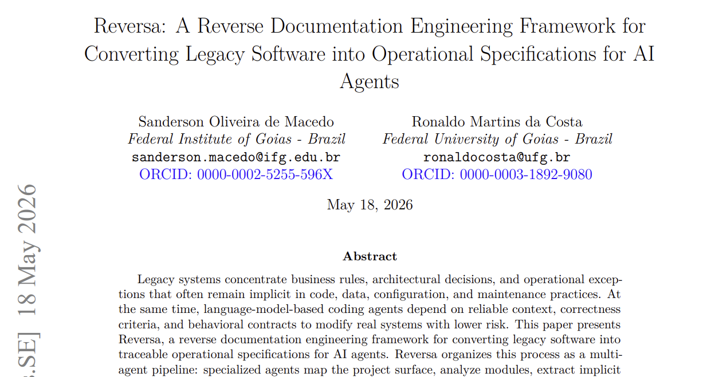
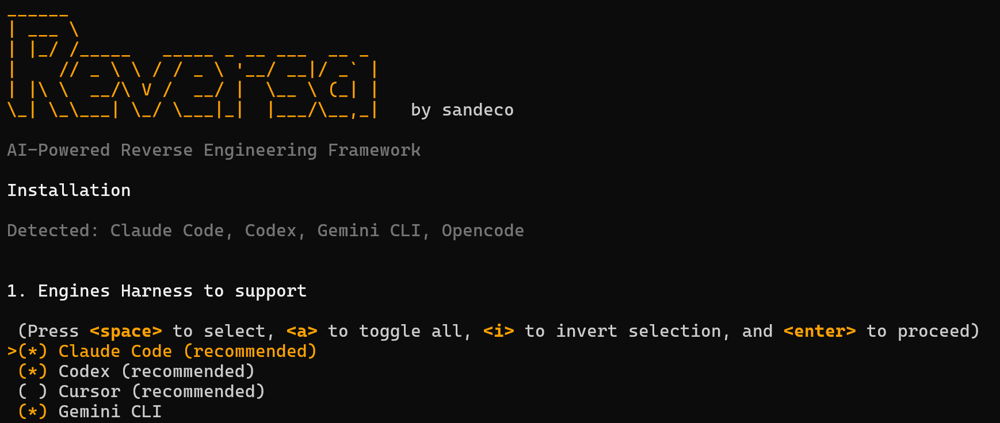

# Solução 
<small>by solucao</small>

**Turn legacy systems into executable specifications for AI agents.**

> 📄 **Paper:** [Solicao: A Reverse Documentation Engineering Framework for Converting Legacy Software into Operational Specifications for AI Agents](https://arxiv.org/abs/2605.18684) — Macedo & da Costa, May 2026.

[](https://arxiv.org/abs/2605.18684)

[](https://cildefonso.github.io/solucao/)<br>
[](https://cildefonso.github.io/solucao/pt/)<br>
[](https://sandeco.github.io/solucao/es/)

A Solução é um framework de engenharia solucao de especificações. Ao instalá-lo em um projeto legado, ele coordena uma equipe de agentes de IA especializados para analisar o código existente e gerar especificações completas e rastreáveis, prontas para uso por qualquer agente de programação.

---



---

## Porque a Solução existe?

Most production systems carry years of accumulated knowledge: implicit business rules, undocumented architectural decisions, critical logic buried in code nobody wants to touch. That knowledge exists, but it's trapped.

AI agents are transformative for creating and evolving software, but they depend on specifications to operate safely. For new systems, you write the spec and the agent executes. For legacy systems — or those built with pure vibe coding — there is no spec: the agent has no way of knowing what it cannot break.

**A Solução é a ponte entre o sistema legado e os agentes de IA.**

It analyzes the existing code, extracts accumulated knowledge (business rules, flows, module contracts, retroactive architectural decisions) and transforms everything into executable, traceable specifications ready for any coding agent.

The result is not documentation for humans to read. These are **operational contracts** that allow an agent to evolve the system with fidelity to what already exists.

---

## Installation

In the root of the legacy project:

```bash
npx solucao install
```

The installer will:
1. Detect the AI engines present in the environment (Claude Code, Codex, Cursor, etc.)
2. Ask which agents to install — all selected by default
3. Collect project name, language, and preferences
4. Copy agents to `.agents/skills/` (and `.claude/skills/` for Claude Code)
5. Create the engine entry file (`CLAUDE.md`, `AGENTS.md`, etc.)
6. Create the `.solucao/` structure with state, configuration, and plan
7. Generate SHA-256 manifest for safe updates

> Solução **never deletes or modifies** existing files in your project.
> Agents write only to `.solucao/` and the output folder (`_solucao_sdd/` by default).

**Requirements:** Node.js 18+

---

> [!IMPORTANT]
> ### 🔒 Guaranteed immutability of the legacy project
>
> The installer only creates new files (`CLAUDE.md`, `AGENTS.md`, `.agents/skills/`, etc.) and **never modifies or deletes any existing file** in your project. During analysis, agents operate under a strict and inviolable directive: **all writes are restricted to `.solucao/` and `_solucao_sdd/`** — no other file in your project is touched.

> [!CAUTION]
> ### 💾 Back up your project before starting
>
> Although Solução never modifies your files, AI agents can make mistakes. **We strongly recommend:**
>
> 1. **Version the project in Git** — make sure all files are committed before starting the analysis
> 2. **Have the repository on GitHub** (or GitLab, Bitbucket) — so you have a safe remote copy
> 3. **Make a local copy of the folder** — a simple `cp -r my-project my-project-backup` protects against any unexpected event
>
> If something unexpected happens during analysis, you can restore the original state with `git restore .` or from the backup copy.

> [!WARNING]
> 🔑 **SOlução não solicita, armazena ou transmite chaves de API de qualquer serviço LLM.** All intelligence is delegated to the AI agent already present in your environment (Claude Code, Codex, Cursor, etc.) — no external authentication dependencies.

---

## How to use

Após a instalação, abra o projeto no agente AI e ative a Solução:

```
/solucao
```

For engines without slash command support (like Codex):

```
solucao
```

solucao will introduce itself, create a personalized exploration plan, and coordinate the entire analysis. Progress is saved in `.solucao/state.json` at each checkpoint — if the session is interrupted, just type `solucao` to resume where you left off.

For other workflows, use the matching entry command:

| Goal | Command |
|------|---------|
| Analyze an existing legacy and produce specs | `/solucao` |
| Run the same analysis end to end, without intermediate stops | `/solucao-autonomous` |
| Start a brand new project from a one-line idea | `/solucao-new` (add `expresso` to go all the way to code) |
| Evolve the system one feature at a time, from spec to code | `/solucao-forward` |
| Add a short amendment to the feature you just delivered | `/solucao-add` |
| Converge a delivered feature back into the extraction | `/solucao-sync` |
| Rebuild the legacy on a modern stack | `/solucao-migrate` |
| Render the extracted knowledge as an HTML mini-site | `/solucao-docs` |
| Track and fix defects with causal traceability | `/solucao-debugger`, `/solucao-debugger-fix` |
| Estimate effort and pricing on top of the specs | `/solucao-pricing-profile`, `/solucao-pricing-size`, `/solucao-pricing-estimate` |

Each orchestrator pauses between agents and asks for `CONTINUAR` before advancing, so you stay in control of every step.

### Unattended runs

Two commands concentrate every question in a **single interview at the start** and then run without stopping, for sessions where nobody is watching the terminal (Claude Code YOLO mode or equivalent):

- `/solucao-autonomous` — the full Discovery pipeline, same agents and same checkpoints as `/solucao`.
- `/solucao-new expresso "<your idea>"` — greenfield from the idea all the way to implemented code, chaining into the forward cycle after the specs.

Both keep the non-destructive rule intact: writes stay inside `.solucao/` and the output folders, and no destructive or outward-facing command (delete, `git push`, publish, install) is ever run on its own. Doubts that come up along the way are recorded with the 🟡 seal instead of interrupting the flow.

---

## How it works

The Discovery pipeline (`/solucao`) is the heart of the framework: a 5-phase sequence orchestrated by the **Solucao** agent.

```
Reconnaissance  Excavation  Interpretation  Generation  Review
    Scout       Archaeologist  Detective      Writer    Reviewer
                                Architect
```

Independent agents (run at any phase): **Visor**, **Data Master**, **Design System**, **Soul Extractor**, **Reconstructor**.

Once the specs exist, you can move forward in three directions, depending on the goal:

```
Discovery (/solucao)
        │
        ├── /solucao-forward    Evolve the system from specs to code
        ├── /solucao-migrate    Rebuild the legacy on a modern stack
        └── /solucao-docs       Render specs as an HTML mini-site
```

For a **greenfield** project (no legacy to extract), start with `/solucao-new` instead. It walks from a one-line idea to SDD specs and then hands off to `/solucao-forward`.

---

## Agents

A Solução organiza seus agentes em **dez equipes especializadas**. A equipe Discovery (núcleo de agentes da Solução) e os agentes de bugs vêm sempre instalados; sete equipes já vêm selecionadas no instalador, enquanto a instalação das equipes de tradução é opcional.

| Team | Purpose | Entry command |
|------|---------|---------------|
| **Solução Agents Core** (Discovery) | Analyze the existing legacy and produce specs | `/solucao` |
| **Ideation Agents** | Clarify a raw idea before any development artifact exists, in greenfield or legacy | `/solucao-brainstorm` |
| **Code New Project Agents** | Start a new project (greenfield) from a one-line idea and produce specs | `/solucao-new` |
| **Code Forward Agents** | Evolve the system from specs to running code, one feature at a time | `/solucao-forward` |
| **Migration Agents** | Turn legacy specs into a rebuild plan for a modern stack | `/solucao-migrate` |
| **Pricing and Size Agents** | Estimate effort, size and pricing on top of the specs | `/solucao-pricing-*` |
| **Documentation Team** | Render the extracted knowledge as a self-contained HTML mini-site | `/solucao-docs` |
| **Bug Agents** | Track, debate and fix defects with causal traceability to the specs | `/solucao-debugger` |
| **Code Quality Agents** | Improve existing code without changing behavior: refactor, optimize, standardize, prune dead code | `/solucao-refactor` |

### Discovery Team, required

These run the main `/solucao` pipeline.

| Agent | Role |
|-------|------|
| **Solucao** | Central orchestrator. Coordinates all agents, saves checkpoints, guides the user |
| **Scout** | Maps the surface: folder structure, languages, frameworks, dependencies, entry points |
| **Archaeologist** | Deep module-by-module analysis: algorithms, control flows, data structures |
| **Detective** | Extracts implicit business knowledge: rules, retroactive ADRs, state machines, permissions |
| **Architect** | Synthesizes everything into C4 diagrams, full ERD, integration map, and technical debt |
| **Writer** | Generates specifications as operational contracts with code traceability |

### Discovery Team, optional (installed by default)

| Agent | Role |
|-------|------|
| **Reviewer** | Reviews specs, finds inconsistencies, and validates gaps with the user |
| **Visor** | Documents the interface from screenshots, without needing the system to be running |
| **Data Master** | Complete database analysis: DDL, migrations, ORM, ERD, triggers, procedures |
| **Design System** | Extracts design tokens: colors, typography, spacing, themes, and components |
| **Soul Extractor** | Produces a single executive Spec (`soul.md`) with purpose, core entities and founding decisions, useful right after Scout |
| **Agents Help** | Explica cada agente de Solucao usando analogias; útil para iniciantes. |
| **Reconstructor** | Generates a bottom-up reconstruction plan from the specs and implements one task at a time, preserving tokens. Activation: `/solucao-reconstructor` |
| **Autonomous** | Runs the same sequence as `/solucao` end to end, with a single interview at the start and no intermediate stops. Activation: `/solucao-autonomous` |

### Ideation Agents (before anything is built)

For the moment when the idea is still raw. Works in **both** scenarios: greenfield, and evolution of an existing legacy. Activate with `/solucao-brainstorm` and the orchestrator drives the pipeline `Framer → Explorer → Challenger → Arbiter → Pre-Spec`, with a `CONTINUAR` checkpoint between agents. Nothing here produces code.

Artifacts live in one folder per session: `_solucao_sdd/brainstorms/<NNN>-<short-name>/`. The active session is tracked in `.solucao/active-ideation.json`. Final handoff goes to `/solucao-new` in greenfield, `/solucao-requirements` in legacy, or `/solucao-migrate` when the intent is a rebuild.

| Agent | Role |
|-------|------|
| **Solução Brainstorm** | Orchestrator. Detects greenfield vs legacy, opens the session folder, routes by physical stage. Writes no pipeline artifact itself |
| **Framer** | Separates problem from solution and refuses to let a solution pass as a problem. Produces `framing.md` with the job to be done and the cost of doing nothing |
| **Explorer** | Opens 3 to 5 materially distinct paths, always including "do not build" and "use something off the shelf". Forbidden from recommending. Produces `options.md` |
| **Challenger** | Premortem, the assumption that kills each option, the cheap test for it, and the hidden cost in the legacy. Adversarial by design. Produces `risks.md` |
| **Arbiter** | Scores the options against the risks and recommends one with an explicit trade-off. The choice stays human, and a divergence from the recommendation is recorded as such. Produces `decision.md` |
| **Pre-Spec** | Turns the decision into the minimum package the next pipeline needs: minimum scope, non-goals, done criterion, open `[DOUBT]` markers. Writes no requirements and no architecture. Produces `pre-spec.md` |

### Code New Project Agents (greenfield)

For projects that do not exist yet. Activate with `/solucao-new` and the orchestrator drives the pipeline `Ideator → Researcher → Drafter → Spec SDD`, with a `CONTINUAR` checkpoint between agents. Final handoff suggests `/solucao-forward` to take the specs to code.

The orchestrator has **two modes**. In *guided* mode (default) it stops at every agent and ends at the specs. In *express* mode (`/solucao-new expresso "<your idea>"`) every question is concentrated in one interview at the start and, after `INICIAR`, the pipeline runs straight through the specs and into the forward cycle (`requirements → plan → to-do → coding`) until the code is on disk.

| Agent | Role |
|-------|------|
| **Solução New** | Orchestrator. Reads the initial brief, walks the pipeline, saves `newproject_progress` in `state.json` |
| **Ideator** | Structured brainstorm with 6 divergent questions (root problem, value, alternatives, audience, success metrics, dangerous assumptions). Produces `_solucao_sdd/ideation.md` |
| **Researcher** | Turns the raw audience into 1 to 3 structured personas with journeys. Produces `_solucao_sdd/personas.md` |
| **Drafter** | Synthesizes ideation and personas into a complete PRD (problem, metrics, scope, non-goals, constraints, risks). Produces `_solucao_sdd/prd.md` |
| **Spec SDD** | Decomposes the PRD into logical components and writes one SDD spec per component, with an automatic quality score. Vendored from the global `sdd-spec` skill. Produces `_solucao_sdd/sdd/*.md` |

### Code Forward Agents (evolution)

The bridge from specs to running code. Pipeline: `requirements → clarify → quality → plan → to-do → audit → coding → sync`. Use `/solucao-forward` as the entry point: it detects the **physical stage** of the active feature (by inspecting the artifacts on disk, not metadata) and suggests the next agent.

| Agent | Role |
|-------|------|
| **Solução Forward** | Orchestrator. Detects the physical stage and suggests the next skill. Never executes code itself |
| **Requirements** | Turns a free-form idea into `requirements.md` anchored to the legacy, with `[DOUBT]` markers, gaps and glossary |
| **Clarify** | Up to 5 targeted questions to resolve `[DOUBT]` markers in place |
| **Quality** | Read-only auditor of writing clarity. Produces `requirements-audit.md` |
| **Plan** | Translates requirements into a technical proposal expressed as a **delta over the legacy**. Produces `roadmap.md`, `investigation.md`, `data-delta.md`, `onboarding.md`, `interfaces/` |
| **To-Do** | Decomposes the roadmap into atomic actions across five phases with stable IDs, dependencies and parallelism markers. Produces `actions.md` |
| **Audit** | Read-only cross-check between requirements, roadmap and actions. Produces `audit/cross-check.md` |
| **Coding** | Executes `actions.md`, flips checkboxes, writes `progress.jsonl`, `legacy-impact.md` and `regression-watch.md` |
| **Add** | Optional and repeatable after coding. Short amendment on the delivered feature: records it in `## Emendas` in `requirements.md`, then implements. Refuses anything needing a new dependency, a schema or contract change, a new public surface, an auth path, or anything outside the active feature's scope. Activation: `/solucao-add` |
| **Sync** | Optional convergence step after coding. Distills the delivered feature into an addendum in `_solucao_sdd/addenda/`, so the extraction keeps describing the system as it is today until the next full re-extraction. Never edits the original artifacts. Activation: `/solucao-sync` |
| **Principles** | Manages durable project rules (`principles.md`) and emits impact reports when they change |
| **Resume** | Swaps the active feature with one from the `paused-features` queue |

### Migration Team

Use after `/solucao` when the goal is to rebuild the legacy on a modern stack. Activate with `/solucao-migrate`. Pipeline: `Paradigm Advisor → Curator → Strategist → Designer → Screen Translator → Inspector`, with a human review pause between agents. Every artifact lands in `_solucao_sdd/migration/`.

| Agent | Role |
|-------|------|
| **Paradigm Advisor** | Detects the legacy paradigm, infers the target paradigm, forces a conscious user decision |
| **Curator** | Decides rule by rule: MIGRATE, DISCARD or HUMAN DECISION |
| **Strategist** | Evaluates Strangler Fig, Big Bang, Parallel Run, Branch by Abstraction and recommends one |
| **Designer** | Drafts target architecture, domain model, data model and data migration plan |
| **Screen Translator** | Translates legacy screens into executable specs in 2 phases (mode decision + spec generation), emitting golden files for the Inspector when an oracle is available |
| **Inspector** | Defines how to prove the new system is behaviorally equivalent to the legacy, with Gherkin parity specs |

### Pricing and Size Team

Three agents on top of the specs to estimate effort, size and price. Activate with `/solucao-pricing-profile`, `/solucao-pricing-size` and `/solucao-pricing-estimate`.

### Translators (input adapters)

Use when the legacy "code" is not source code but a structured artifact like a visual workflow. Generates the SDD spec and prepares the state for the main pipeline to take over.

| Agent | Role |
|-------|------|
| **N8N Translator** | Reads N8N workflows exported as JSON and produces SDD specs ready for Python reimplementation. Activated via `/solucao-n8n` |

### Documentation Team (HTML mini-site)

After discovery completes, this team turns the extracted knowledge into a self-contained HTML mini-site under `_solucao_docs/`. Run `/solucao-docs` to orchestrate the full team, or activate any agent in isolation to regenerate only its pages.

| Agent | Role |
|-------|------|
| **Solução Docs** | Orchestrates the team, runs the 3-question interview, computes deterministic seed. Activated via `/solucao-docs` |
| **Mapper** | Spatial structure: `arquitetura.html` (Code City 3D, Three.js), `modulos.html` (force-directed D3), `topologia.html` (legacy vs modern side-by-side) |
| **Analyst** | Quantitative data: `metricas.html` (Highcharts treemap, sankey, histogram, columns), `timeline.html` (events from `.solucao/chronicle.md`) |
| **Storyteller** | Narrative: `glossario.html` (client-side search), `deck.html` (6 to 10 navigable slides), `features/<spec>.html` (one per SDD spec) |
| **Publisher** | Final integration: `index.html` with hero + unique generative seal, auto-discovery of auxiliary HTMLs from other agents, link validation, local telemetry |

The team brings 5 shared skills (`solucao-arquitetura-3d`, `solucao-selo-generativo`, `solucao-highcharts-visualizer`, `solucao-especialista-d3`, `solucao-image-prompt-json`) which are installed automatically alongside the team. The output is a static mini-site that opens via `file://` with no server required.

### Bug Agents

A repository-native causal defect memory, organized by **context** (the feature/module/use case the user is talking about): each context folder under `_solucao_bugs/<context>/` aggregates everything of that area (annotated reports in `intake/`, self-contained bug folders, inspections and generated views incl. a clickable `graph.html`). Every bug carries a YAML front matter record traceable to the specs (`SPEC ↔ CODE ↔ TEST ↔ BUG`), a visual fix plan approved before any change, and a `DONE.md` lock once closed. Registering and fixing are strictly separate acts.

| Agent | Role |
|-------|------|
| **Bug** | Intake, triage, dedupe, classification and initial traceability. Never fixes. Activated via `/solucao-debugger` |
| **Bug Fix** | Lifecycle orchestrator: mitigation, reproduction capsule, evidence-based root cause, two approval gates (failing tests, then the change set), spec verdict with versioned addenda, closure policy. Activated via `/solucao-debugger-fix` |
| **Bug Debate** | Fixed-epoch multi-agent debate with an isolated judge, in three modes (`diagnosis`, `repair`, `spec`). Always opt-in, with cost shown upfront; external harnesses (Codex, Gemini CLI, ...) may join only with explicit consent. Activated via `/solucao-debugger-debate` |
| **Depth Inspection** | Deep sweep of a problematic feature through specialized lenses (spec conformance, data flow, contracts, error states, test coverage, concurrency). Diagnosis only; confirmed findings become registered bugs. Activated via `/solucao-depth-inspection` |
| **Bug Graph** | Regenerates the derived views: index, compact catalog, sparse relation matrix, mermaid graph with clusters and impact score, and the BUG ↔ SPEC traceability matrix on both ends (`_solucao_bugs/generated/` and `_solucao_sdd/traceability/bugs.md`). Activated via `/solucao-debugger-graph` |

### Code Quality Agents

Perfective and preventive maintenance on code that already works: improve the internal structure **without changing observable behavior**, and prove that preservation before touching the code. Organized by **context** under `_solucao_refactor/<context>/`, with each transformation anchored to the soul (`soul.md`) and confirmed specs. The founding rule: proposing a transformation and applying it are separate acts, and nothing touches the legacy without proof of behavior preservation (a **safety net** of characterization tests, plus soul and regression checks). Project code changes only through an approved, reversible diff gate.

| Agent | Role |
|-------|------|
| **Refactor** | Orchestrator: inventories improvement opportunities, prioritizes by real ROI (hotpath, not aesthetics), routes to the right specialist and runs the gates. Never applies a transformation. Activated via `/solucao-refactor` |
| **Restructure** | Internal structure at method/class level via the Fowler catalog, in small reversible steps. Activated via `/solucao-restructure` |
| **Modularize** | Splits a large piece into cohesive modules with well-defined responsibility, respecting the soul's boundaries. Activated via `/solucao-modularize` |
| **Decouple** | Reduces direct dependencies (dependency inversion, Feathers seams, cycle breaking), coupling measured before and after. Activated via `/solucao-decouple` |
| **Optimize** | Reduces time, memory and resource use, with a before/after measurement and preserved output. Activated via `/solucao-optimize` |
| **Simplify** | Replaces complex logic with a simpler one, with a proof of output equivalence. Activated via `/solucao-simplify` |
| **Standardize** | Applies naming, formatting and organization conventions from the project's dominant pattern, never changing semantics. Activated via `/solucao-standardize` |
| **Prune** | Removes dead code, and only what it can prove is dead, telling dead code from a suspected orphan. Activated via `/solucao-prune` |

---

## What is generated

```
_solucao_sdd/
├── inventory.md              # Project inventory
├── dependencies.md           # Dependencies with versions
├── code-analysis.md          # Technical analysis per module
├── data-dictionary.md        # Data dictionary
├── domain.md                 # Glossary and business rules
├── state-machines.md         # State machines in Mermaid
├── permissions.md            # Permission matrix
├── architecture.md           # Architectural overview
├── c4-context.md             # C4 Diagram: Context
├── c4-containers.md          # C4 Diagram: Containers
├── c4-components.md          # C4 Diagram: Components
├── erd-complete.md           # Full ERD in Mermaid
├── confidence-report.md      # Confidence report 🟢🟡🔴
├── gaps.md                   # Identified gaps
├── questions.md              # Questions for human validation
├── sdd/                      # Specs per component
│   └── [component].md
├── openapi/                  # API specs (if applicable)
├── user-stories/             # User stories (if applicable)
├── adrs/                     # Retroactive architectural decisions
├── flowcharts/               # Flowcharts in Mermaid
├── sequences/                # Sequence diagrams
├── ui/                       # Interface specs (Visor)
├── database/                 # Database specs (Data Master)
├── design-system/            # Design tokens (Design System)
├── addenda/                  # Post-delivery addenda, one per feature (Sync)
└── traceability/
    ├── spec-impact-matrix.md # Which spec impacts which
    └── code-spec-matrix.md   # Code file to corresponding spec
```

In a greenfield run, `/solucao-new` adds the following on top of `_solucao_sdd/`:

```
_solucao_sdd/
├── newproject-brief.md      # Initial brief (Solucao New)
├── ideation.md              # Structured brainstorm (Ideator)
├── personas.md              # Personas with journeys (Researcher)
├── prd.md                   # Product Requirements Document (Drafter)
└── sdd/
    └── [component].md       # SDD specs with quality score (Spec SDD)
```

Forward features land in a separate folder, `_solucao_forward/` by default:

```
_solucao_forward/
└── <NNN>-<short-name>/      # One folder per feature
    ├── requirements.md
    ├── roadmap.md
    ├── investigation.md
    ├── data-delta.md
    ├── onboarding.md
    ├── interfaces/
    ├── actions.md
    ├── progress.jsonl
    ├── legacy-impact.md
    ├── regression-watch.md
    └── audit/
        ├── requirements-audit.md
        └── cross-check.md
```

After `/solucao-coding`, the optional `/solucao-sync` distills the delivered feature into `_solucao_sdd/addenda/<feature-id>-<short-name>.md`. The addendum is a bridge: it keeps the extraction representative of the system as it is today, points at the sections of `architecture.md` and `domain.md` that drifted, and is marked as superseded by the next full re-extraction. Original extraction artifacts are never edited.

Ideation Agents write only inside `_solucao_sdd/brainstorms/` (one folder per session) and `.solucao/active-ideation.json`. They never touch project code and never produce code.

The Documentation Team writes only inside `_solucao_docs/` (HTML mini-site, fully offline).

Bug Agents write only inside `_solucao_bugs/` (one folder per bug, plus generated views), spec addenda in `_solucao_sdd/addenda/` and the generated mirror `_solucao_sdd/traceability/bugs.md`. Original specs are never edited; project code changes only through approval gates with explicit diffs.

Code Quality Agents write only inside `_solucao_refactor/` (opportunities, plans and transformation records per context). Project code changes exclusively through an approved, reversible diff gate, and only after the safety net proves behavior is preserved.

### Confidence scale

Every statement in the specs is marked with:

| Mark | Meaning |
|------|---------|
| 🟢 CONFIRMED | Extracted directly from code — can be cited with file and line |
| 🟡 INFERRED | Deduced from patterns — may be wrong |
| 🔴 GAP | Not determinable from code — requires human validation |

---

## Supported engines

| Engine | File created | Skills path | Activation |
|--------|-------------|-------------|------------|
| Claude Code ⭐ | `CLAUDE.md` | `.claude/skills/solucao-*/` and `.agents/skills/solucao-*/` | `/solucao` |
| Codex ⭐ | `AGENTS.md` | `.agents/skills/solucao-*/` | `solucao` |
| Cursor ⭐ | `.cursorrules` | `.agents/skills/solucao-*/` | `/solucao` |
| Gemini CLI | `GEMINI.md` | `.agents/skills/solucao-*/` | `/solucao` |
| Windsurf | `.windsurfrules` | `.agents/skills/solucao-*/` | `/solucao` |
| Antigravity | `AGENTS.md` | `.agents/skills/solucao-*/` | `/solucao` |
| Kiro | (none) | `.kiro/skills/solucao-*/` and `.agents/skills/solucao-*/` | `/solucao` |
| Opencode | `AGENTS.md` | `.agents/skills/solucao-*/` | `solucao` |
| Cline | `.clinerules` | `.agents/skills/solucao-*/` | `/solucao` |
| Roo Code | `.roorules` | `.agents/skills/solucao-*/` | `/solucao` |
| GitHub Copilot | `.github/copilot-instructions.md` | `.agents/skills/solucao-*/` | `/solucao` |
| Aider | `CONVENTIONS.md` | `.agents/skills/solucao-*/` | `solucao` |
| Amazon Q Developer | `.amazonq/rules/solucao.md` | `.agents/skills/solucao-*/` | `/solucao` |

---

## CLI commands

```bash
npx solucao install      # Install solucao in the project
npx solucao status       # Show current analysis state
npx solucao update       # Update agents to the latest version
npx solucao add-agent    # Add an agent to the project
npx solucao add-engine   # Add support for a new engine
npx solucao uninstall    # Remove Solução from the project
```

The `update` command detects files you modified via SHA-256 and never overwrites customizations.
O `uninstall` O comando remove apenas arquivos criados pela Solução — nada do projeto legado é afetado.

---

## Internal structure

```
.solucao/
├── state.json          # Analysis state between sessions
├── config.toml         # Project configuration
├── config.user.toml    # Personal preferences (don't commit)
├── plan.md             # Exploration plan (user-editable)
├── version             # Installed version
├── context/
│   ├── surface.json    # Generated by Scout
│   └── modules.json    # Generated by Archaeologist
└── _config/
    ├── manifest.yaml       # Installation metadata
    └── files-manifest.json # SHA-256 hashes for safe updates

.agents/skills/         # Universal skills (all compatible agents)
.claude/skills/         # Mirror for Claude Code
```

---

## Contributing

Contributions are welcome. Open an issue to discuss before submitting a PR.

```bash
git clone https://github.com/cildefonso/solucao.git
cd solucao
npm install
```

---

## License

MIT — see [LICENSE](LICENSE) for details.
