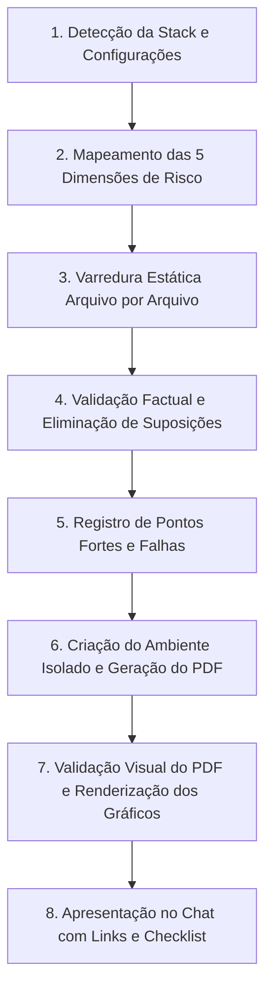

# Auditoria Avançada de Segurança de Código e Governança de Riscos

Esta skill executa uma auditoria profunda, sistemática e orientada a evidências no código-fonte, configurações de infraestrutura e pipelines do projeto, identificando vulnerabilidades arquiteturais e operacionais em **cinco dimensões críticas de segurança**.

A auditoria opera sob o princípio de **Fato Comprovado**: não relata vulnerabilidades teóricas ou especulativas sem evidência no código real e documenta rigorosamente tanto os pontos fracos quanto as defesas efetivas (pontos fortes) encontradas no projeto.

---

## Quando Utilizar Esta Skill

- Quando o usuário solicitar:
  - *"Auditar segurança do código"*
  - *"Revisar vulnerabilidades no repositório"*
  - *"Fazer pentest estático / code review de segurança"*
  - *"Verificar falhas de autorização, IDOR, chaves expostas ou isolamento multitenant"*
  - *"Gerar relatório de auditoria de segurança em PDF com issues para o GitHub"*

---

## 1. Fase 1: Reconhecimento e Adaptação Contextual à Stack

Antes de iniciar a busca por falhas, o agente **DEVE INSPECIONAR O REPOSITÓRIO** para detectar a composição tecnológica e definir a matriz de equivalência:

1. **Linguagem e Runtime**: Java (17/21/24), TypeScript, JavaScript, Python, Go, C# (.NET), PHP, etc.
2. **Framework Backend**: Quarkus, Spring Boot, NestJS, Express, FastAPI, Django, ASP.NET Core, etc.
3. **Persistência / ORM / Query Engine**: Panache/Hibernate JPA, Prisma, TypeORM, SQLAlchemy, Dapper, Native SQL/JDBC, Supabase RLS, MongoDB.
4. **Mecanismo de Autenticação e Autorização**: OIDC Keycloak, JWT Bearer, Spring Security, Quarkus Security, NextAuth, Casbin, RBAC/ABAC customizado.
5. **Camada Frontend**: React, Angular, Vue, Next.js, Nuxt, Thymeleaf, JSP, Blade, ou API pura (Headless).
6. **Infraestrutura e Deploy**: Dockerfile, docker-compose, Helm Charts, Kubernetes manifests, Bicep, Terraform, GitHub Actions, GitLab CI.

### Matriz de Equivalência Técnica das 5 Dimensões:

| Dimensão | Java (Quarkus / Spring) | Node.js / TypeScript | Python (FastAPI / Django) | Supabase / BaaS / SQL |
|---|---|---|---|---|
| **1. Banco Sem Tranca** | Falta de filtro por `tenantId`/`codUsuario` em Panache/JPA/NamedQuery; ausência de `@Filter` Hibernate | Queries sem `where: { tenantId }` no Prisma/TypeORM; queries SQL cruas sem tenancy | Model.objects.filter() sem `user`/`organization`; queries raw | RLS desabilitado ou com `USING (true)` em tabelas com dados de clientes |
| **2. Permissão no Navegador** | Endpoints `@Path` ou `@RestController` sem `@RolesAllowed`, `@PreAuthorize` ou checagem de claims do SecurityIdentity | Frontend omite botões com `v-if="isAdmin"` mas rota Express/Nest não possui Guard | Views com UI restrita por template sem decorators `@user_passes_test` ou `@permission_required` | Políticas RLS que checam apenas autenticado (`TO authenticated`) sem verificar role na tabela de perfil |
| **3. IDOR** | `@GET /api/recursos/{id}` buscando por chave primária pura sem cruzar com `usuarioLogado.id` | `findOne({ where: { id: req.params.id } })` sem incluir `tenant_id: req.user.tenantId` | `get_object_or_404(Model, pk=id)` sem filtrar `user=request.user` | `SELECT * FROM tbl WHERE id = $1` permitido a qualquer usuário autenticado |
| **4. Chaves Expostas** | `application.properties` com `senha=default`, secrets embutidos em `${VAR:segredo-real}`, ausência de `@ConfigMapping` com validação | `.env` commitado, chaves `NEXT_PUBLIC_` contendo secrets de serviço, fallbacks `process.env.KEY || 'secret'` | `settings.py` com `SECRET_KEY = "django-insecure-..."` ou tokens de IA hardcoded | Arquivos `wrangler.toml`, `supabase/config.toml` ou docker-compose com tokens de admin commitados |
| **5. Inputs Sem Tratamento** | Concatenação de string em JPQL/Native Query, geração de HTML/e-mail sem escape contextual | Uso de `dangerouslySetInnerHTML`, `v-html`, `innerHTML`, interpolação crua em e-mails HTML | `mark_safe()`, templates Jinja com `autoescape=False`, f-strings em queries SQL | Interpolação de variáveis em queries dinâmicas sem parâmetros bind |

---

## 2. Fase 2: Execução Sistemática da Auditoria (As 5 Categorias)

O auditor deve analisar **todos os arquivos relevantes**, sem se limitar a amostragens.

### Categoria 1: BANCO SEM TRANCA (Isolamento de Inquilino / Dono)
- **O que inspecionar**:
  - Mecanismo central de isolamento adotado pelo projeto (RLS no banco, multi-schema, discriminator column com `@FilterDef`, middlewares de tenant).
  - Rotas de listagem, busca, relatórios, exportações de dados e agregações (`COUNT`, `SUM`).
  - Queries de segundo plano, schedulers e processamento assíncrono.
- **Evidência de Falha**:
  - Uma query de listagem (ex: `BeneficioContaDao.listarTodos()`) que executa `SELECT * FROM TABELA` sem cláusula `WHERE COD_EMPRESA = :empresa` ou `WHERE COD_USUARIO = :usuario`.
- **Registro de Ponto Forte**:
  - Quando um DAO ou repositório injeta o contexto de segurança e garante o filtro em 100% das operações de leitura.

### Categoria 2: PERMISSÃO DEFINIDA NO NAVEGADOR (Client-Side Only Authorization)
- **O que inspecionar**:
  - Cruzamento de cada barreira visual do frontend (`canEdit`, `isAdmin`, `roles.includes(...)`, menus condicionais) com o backend correspondente.
  - Endpoints de escrita (`POST`, `PUT`, `PATCH`, `DELETE`) e endpoints com dados sensíveis (gestão de usuários, parâmetros, relatórios financeiros).
  - APIs internas que presumem que "se o usuário chamou, ele tem o papel necessário".
- **Evidência de Falha**:
  - Frontend esconde o botão "Excluir Conta" se `user.role !== 'ADMIN'`, mas o endpoint `DELETE /api/v1/contas/{id}` possui apenas autenticação genérica sem validar se o token possui a role `ADMIN`.

### Categoria 3: IDOR (Insecure Direct Object Reference)
- **O que inspecionar**:
  - Handlers de rota que recebem identificadores externos via PathParam, QueryParam ou Body (ex: `uuid`, `id`, `numeroConta`, `codigoBeneficio`).
  - Operações de leitura individual (`GET /itens/{id}`), alteração (`PUT /itens/{id}`) e remoção (`DELETE /itens/{id}`).
- **Evidência de Falha**:
  - O backend recupera a entidade pelo `id` fornecido e retorna/altera o registro diretamente, sem checar se `entidade.donoId == usuarioAutenticado.id` ou se o usuário tem privilégio de acesso sobre aquele objeto específico.

### Categoria 4: CHAVES EXPOSTAS E DEFAULTS INSEGUROS (Hardcoded Secrets & Defaults)
- **O que inspecionar**:
  - Arquivos de configuração (`application.properties`, `application.yml`, `.env*`, `settings.py`, `config.json`).
  - Fallbacks perigosos no código: `${VAR:valor-default}`, `process.env.SECRET || 'secret123'`, `os.getenv("KEY", "chave-fixa")`.
  - Ausência de validação de startup: a aplicação sobe em modo de produção aceitando senhas ou segredos padrão?
  - Histórico git recente e commits à procura de tokens, senhas de banco de dados, chaves privadas PEM/JKS ou certificados embutidos.
  - Bundles de frontend: secrets de backend vazados em variáveis expostas ao cliente (ex: `REACT_APP_`, `NEXT_PUBLIC_`, `VITE_`).

### Categoria 5: INPUTS SEM TRATAMENTO (XSS, Injection e Context Escape)
- **O que inspecionar**:
  - **Frontend**: `innerHTML`, `dangerouslySetInnerHTML`, `v-html`, diretivas sem sanitização, URLs controladas por usuário em links (`href="javascript:..."`).
  - **Backend**: Entradas de usuário injetadas em templates de e-mail, geradores de PDF/HTML (Thymeleaf, Freemarker, Jinja, Handlebars) sem escape de contexto.
  - **Consultas a Banco**: Concatenação direta de strings em comandos SQL, JPQL, HQL ou NoSQL em vez de binds nomeados (`:param` ou `?`).
  - **Cabeçalhos e Respostas**: Reflexão de parâmetros de requisição em cabeçalhos HTTP (CRLF injection) ou mensagens de erro cruas retornadas com dados do atacante.

---

## 3. Critérios Obrigatórios para Validação de Achados

Para evitar qualquer falso positivo ou ruído na entrega:
1. **Verificação Direta**: Cada apontamento deve ser comprovado diretamente no código existente no repositório.
2. **Severidade Padronizada**:
   - **CRÍTICA**: Permite comprometimento imediato de dados de múltiplos inquilinos, bypass completo de autenticação ou execução de código sem autenticação prévia.
   - **ALTA**: Permite acesso a recursos sensíveis de outros usuários (IDOR direto), quebra de autorização em ações administrativas ou vazamento de segredos de produção.
   - **MÉDIA**: Vulnerabilidades que requerem pré-condições específicas, falhas em ambientes secundários, defaults inseguros sem validação no startup ou XSS com escopo restrito.
   - **BAIXA**: Falta de cabeçalhos de proteção suplementares, mensagens de erro excessivamente detalhadas ou inconsistências menores de sanitização.
   - **INFORMATIVA / PONTO FORTE**: Medidas defensivas bem implementadas ou recomendações de endurecimento arquitetural.
3. **Formato Obrigatório de Cada Achado no Chat e no Relatório**:
   - **ID**: `SEC-001`, `SEC-002`, etc.
   - **Categoria**: 1 a 5.
   - **Severidade**: Crítica, Alta, Média, Baixa.
   - **Localização**: `caminho/do/arquivo:linha` (link Markdown).
   - **Evidência de Código**: Trecho exato das linhas auditadas.
   - **Vetor de Exploração**: Como um atacante explora a falha no cenário real.
   - **Ação de Remediação**: Código de correção recomendado.

---

## 4. Fase 3: Geração Automatizada do Relatório em PDF

A skill deve gerar um relatório executivo e técnico em PDF no caminho:
`docs/security-audit/relatorio-auditoria-seguranca.pdf`

### 4.1. Requisitos Técnicos de Execução Isolada
- **NUNCA instalar pacotes globalmente na máquina**.
- Utilizar um ambiente Python isolado (`.venv` criado temporariamente ou reaproveitado dentro de `docs/security-audit/.venv`) contendo as bibliotecas `reportlab` e `matplotlib` para compor o documento e renderizar os gráficos de rosca e barras.
- Caso o ambiente já disponha de Chromium headless, Pandoc ou ferramenta equivalente compatível com a stack local, a conversão HTML5/CSS Print para PDF também é aceita, desde que respeite rigorosamente o padrão visual A4.
- O script gerador DEVE ser salvo em `docs/security-audit/generate_audit_report.py` para permitir que o usuário regere o relatório a qualquer momento com um único comando.

### 4.2. Estrutura e Identidade Visual do PDF (Padrão A4)
- **Margens**: ~2 cm em todas as bordas.
- **Cabeçalho e Rodapé**: Nome do relatório, data, numeração de página sequencial (ex: `Página X de Y`).
- **Paleta de Cores Estrita**:
  - **Crítica**: `#B91C1C` (Vermelho escuro)
  - **Alta**: `#EA580C` (Laranja)
  - **Média**: `#D97706` (Âmbar)
  - **Baixa**: `#2563EB` (Azul)
  - **Ponto Forte**: `#059669` (Verde esmeralda)
  - **Neutros/Texto**: `#1E293B` (Texto primário), `#64748B` (Texto secundário), `#F8FAFC` (Fundo claro de tabelas/cards)

### 4.3. Seções Obrigatórias do PDF:
1. **Capa**:
   - Título: `Relatório de Auditoria de Segurança — <Nome do Projeto>`
   - Data da auditoria, versão do documento, analista/auditor responsável.
   - Escopo auditado (repositório, branches, commits e módulos incluídos).
   - Nota Metodológica: explicação de como as 5 dimensões foram mapeadas para a stack detectada.
2. **Resumo Executivo**:
   - Resumo consolidado de postura de segurança.
   - **Gráfico 1 (Rosca)**: Distribuição percentual e quantitativa dos achados por severidade (Crítica, Alta, Média, Baixa).
   - **Gráfico 2 (Barras)**: Distribuição quantitativa de achados e pontos fortes por categoria (1 a 5).
3. **Quadro de Pontos Fortes e Riscos Centrais**:
   - Listagem explícita dos mecanismos de defesa que foram auditados e estão **corretos e aprovados**.
   - Síntese dos riscos centrais que exigem atenção imediata da equipe.
4. **Tabela Detalhada de Achados por Categoria**:
   - Colunas: `ID` | `Severidade (badge colorido)` | `Localização (Arquivo:Linha)` | `Resumo da Vulnerabilidade`.
   - Cards de detalhamento para achados de severidade Crítica e Alta com trechos de código e impacto.
5. **Plano de Remediação Priorizado**:
   - Tabela de ações ordenadas por prioridade técnica (`P1 - Imediato`, `P2 - Curto Prazo`, `P3 - Melhoria Contínua`).
6. **Seção "ISSUES PARA O GITHUB" (Prontas para Uso)**:
   - Ao final do PDF, cada achado acionável (ou grupo de achados correlatos) deve ser transcrito no formato exato de uma Issue de GitHub em Markdown.
   - Cada issue deve ficar em bloco delimitado:
     ```markdown
     --- ISSUE <N> ---
     ### [Segurança] <Título curto da falha>
     **Labels**: `security`, `<severidade>`

     #### Descrição do Problema
     ...

     #### Evidência
     - **Arquivo**: `caminho/do/arquivo:linha`
     ```<linguagem>
     // Trecho do código vulnerável
     ```

     #### Impacto
     ...

     #### Sugestão de Correção
     ```<linguagem>
     // Trecho corrigido
     ```

     #### Critérios de Aceite (Checklist)
     - [ ] Critério 1 verificável
     - [ ] Critério 2 verificável
     --- FIM ISSUE <N> ---
     ```

---

## 5. Roteiro Passo a Passo de Execução da Skill



### Passo 1: Detecção e Mapeamento
Identifique `pom.xml`, `package.json`, `requirements.txt`, `Dockerfile`, configurações e mapeie o pacote corporativo (ex: `br.com.imac.<projeto>.api`).

### Passo 2: Execução das Varreduras
Use buscas por padrões (`grep_search` / `file_search`) para encontrar pontos sensíveis em DAOs, Services, Resources/Controllers, templates e arquivos de configuração.

### Passo 3: Geração do Script e PDF
Crie `docs/security-audit/generate_audit_report.py` utilizando o template padrão em [pdf-generator-template.py](./references/pdf-generator-template.py), instale em ambiente isolado as dependências (`reportlab`, `matplotlib`) e execute o script.

### Passo 4: Verificação da Integridade
Valide se `docs/security-audit/relatorio-auditoria-seguranca.pdf` foi gerado sem erros, verifique o número de páginas e assegure que os gráficos estão legíveis e bem formatados.

### Passo 5: Entrega Final
Apresente no chat:
1. Caminho do PDF gerado.
2. Tabela resumida de achados linha a linha.
3. Relação dos pontos fortes auditados.
4. Lista de todos os arquivos criados ou atualizados.
